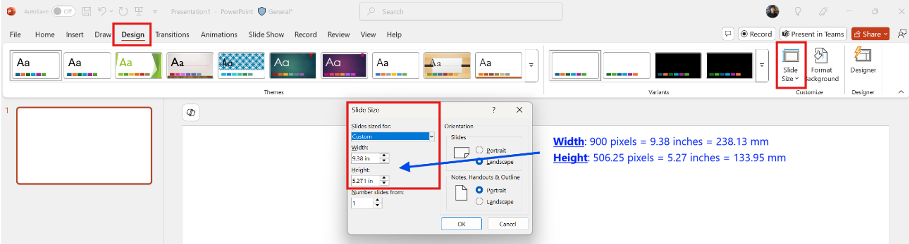
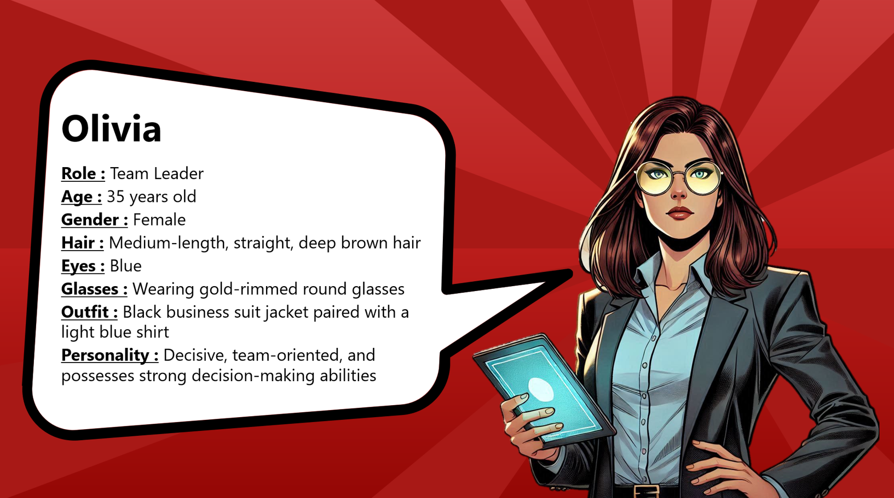
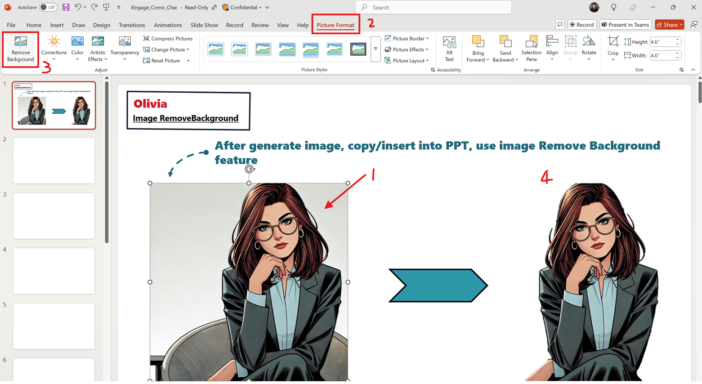
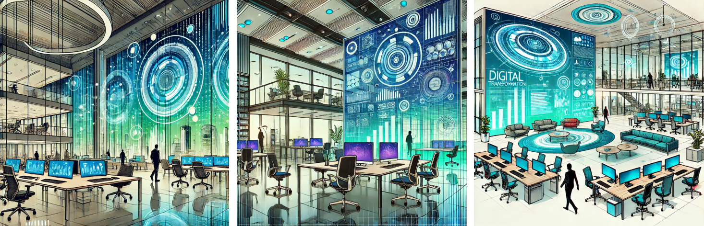
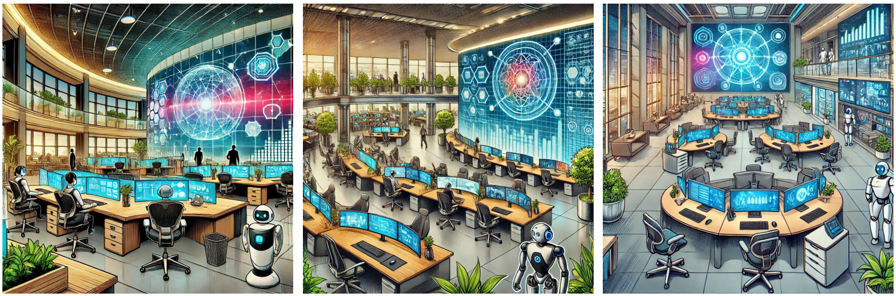
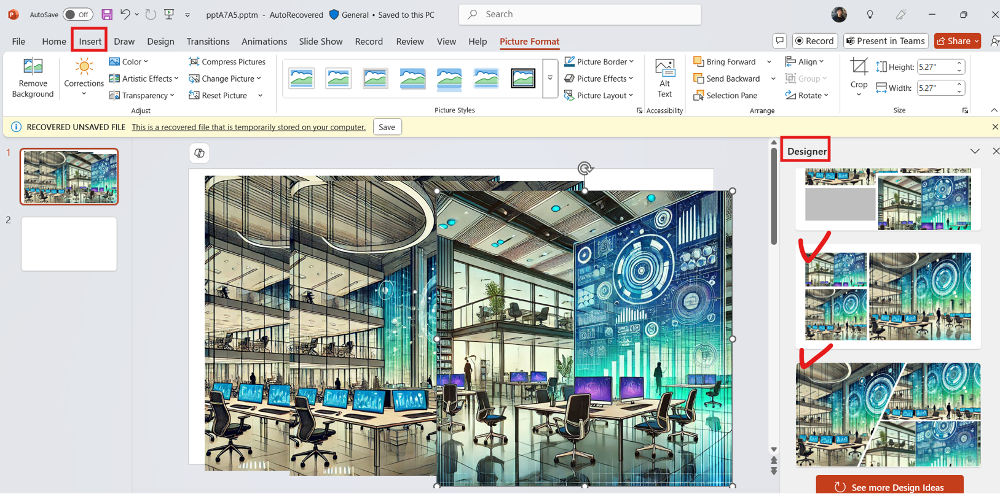
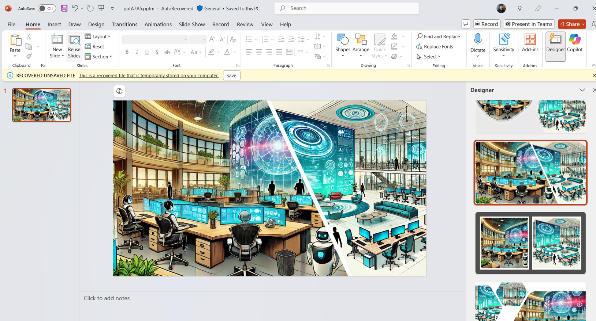
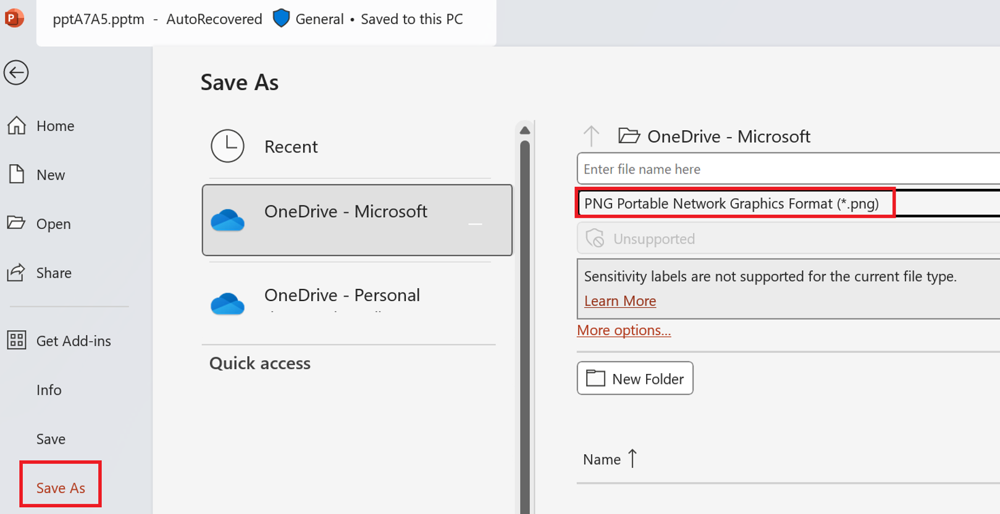
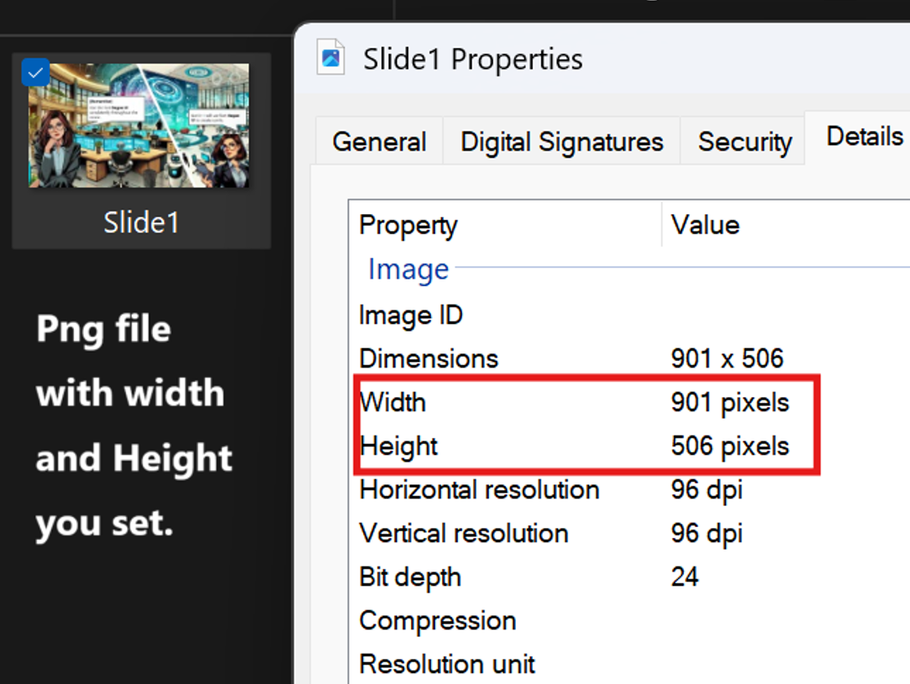
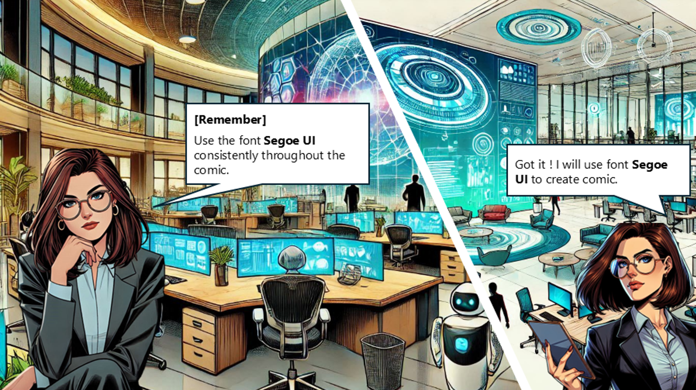

# Guidance for Comic Creation

1.	**Things to Consider Before Comic Creation**
    + Avoid Generic Content
        + The comic’s content **<u>should be specific and focused rather than broad or generic.</u>** 
        + For example: Avoid general explanations like “What is Cosmos DB” or “What is a Lakehouse.”
        + Focus on more specific topics like “Model Benchmarking” or “Actions in Copilot,” providing actionable insights or real-world examples that the audience can directly apply.
    + Ensure Content Relevance:
        + Make sure the comic content aligns with the audience’s needs or the core goals of the topic to maximize its value and appeal.
    + Some Related Topics: 
        + **<u>Alignment with Course Learning Objectives:</u>** Select topics aligned with specific course modules and learning objectives. This ensures the comic serves as a useful overview document for pre-class reading or a review document for post-class reflection, helping learners better understand the course material.
        + **<u>Support In-Depth Feature Explanations:</u>** Focus on an in-depth explanation of specific features or functions within the course to enhance the delivery and comprehension of the material, providing learners with practical and actionable insights.

2.	**Set Up the Environment for Asset Creation**
    + It is recommended to use **<u>PowerPoint (PPT)**</u> to create comics, ensuring consistency in asset sizes and ease of use.
    + Recommended Dimensions:
        + **<u>Width:**</u> 900 pixels = 9.38 inches = 238.13 mm 
        **<u>Height:**</u> 506.25 pixels = 5.27 inches = 133.95 mm
        + This configuration maintains a **16:9 aspect ratio**, enabling you to fully leverage **PPT Copilot Designer** to optimize image layouts efficiently and effectively.
        + **[Note]** Each asset’s **<u>total width must not exceed 1000 pixels**</u> (approximately 10.42 inches / 264.16 mm).
 
    + Follow these steps to configure your PPT size:
        + Go to **[Design] > [Slide Size] > [Custom Slide Size]**
        
    + **Font**
        + Use the font **<u>Segoe UI**</u> consistently throughout the comic to ensure a unified visual appearance.

3.	**Preparation Before Creating Comics – Create Character**
    + Proper preparation before starting comic creation can make the process much smoother and more efficient.
    + Use the **<u>Same Style**</u>:
        + Choose a unified character style (e.g., Marvel, cartoon, realistic, etc.) to ensure consistency throughout the comic.
    + Unified Character Attributes: **<u>Use the same prompt to generate characters and fix the following attributes to maintain consistency**</u>
        + Eye color
        + Clothing style and color
        + Hairstyle and hair color
    + Example
        + Defining a character first can help you easily create unified character attributes. 
        
        +  Example Prompt
        
            1. Create a Marvel-style comic illustration of a white American woman with medium-length, straight deep brown hair, blue eyes, wearing gold-rimmed round glasses. She is dressed in a professional outfit featuring a black business suit jacket paired with a light blue shirt. The setting depicts her standing with one hand confidently placed on her hip and the other holding a holographic tablet, her expression exuding decisiveness and leadership. The background is a plain white color, ensuring the focus remains entirely on the character's dynamic pose and presence.
            2. Create a Marvel-style comic illustration of a white American woman with medium-length, straight deep brown hair, blue eyes, wearing gold-rimmed round glasses. She is dressed in a professional outfit featuring a black business suit jacket paired with a light blue shirt. The setting depicts her seated on a modern chair, her head slightly tilted to the left as she rests her chin on her hand, with a thoughtful expression. The background is a plain white color, emphasizing the character's contemplative pose.
            3. Create a Marvel-style comic illustration of a white American woman with medium-length, straight deep brown hair, blue eyes, wearing gold-rimmed round glasses. She is dressed in a professional outfit featuring a black business suit jacket paired with a light blue shirt. The setting depicts her standing with her weight shifted slightly to one leg, her head tilted slightly to the left, and her arms crossed in a confident and composed stance. The background is a plain white color, keeping the focus on the character's poised and professional demeanor.
    + After generating multiple character images with various poses, you can import them into PowerPoint for background removal.
    

4.	**Preparation Before Creating Comics – – Create Backgrounds**
    + Maintain Consistent Style:
        + Ensure the background style matches the character style (e.g., cartoon, realistic, Marvel, etc.) for a cohesive visual presentation.
    + Flexible Scene Pairing:
        + Use the same prompt to generate multiple background scenes. This allows you to pair them freely with characters, catering to various scenarios in the comic.
        + Example Prompt: 
            1.	Create a Marvel-style comic illustration of a modern office environment designed for digital transformation. The scene includes sleek, open-plan workspaces with glass partitions, ergonomic furniture, and a large digital screen wall displaying abstract data visualizations in vibrant blue and green tones. The setting features high-tech elements like holographic projectors and minimalist decor, emphasizing innovation and cutting-edge technology. Ensure the background has no text or signage, keeping the focus on the futuristic office ambiance.
            
            2.	Create a Marvel-style comic illustration of a high-tech office tailored for digital transformation activities. The scene includes an ultra-modern workspace with curved desks embedded with digital touchscreens, autonomous robotic assistants gliding through the room, and a large wall display showing a vibrant network map. The ceiling has ambient lighting with a futuristic design, and greenery is subtly integrated into the decor for a harmonious blend of technology and nature. No text or signage should appear in the illustration, highlighting the sleek and advanced office setting.
            
  
    + Leverage PPT Copilot Designer:
        + Utilize the PPT Copilot Designer feature to automatically slice and adjust background images, enabling quick creation of visuals tailored for comic panels.
        
        

5.	**Focus on Content Development**
    + Create Dialogue Based on Selected Topics: 
        + Design dialogues between characters based on the chosen course-related topic, ensuring the conversations align closely with the learning objectives and enhance the learning experience.
    + Integrate Backgrounds and Characters:
        + In PPT, combine the generated backgrounds, characters with removed backgrounds, and dialogue boxes to create complete comic scenes.
        + Ensure proper proportions and placement of characters and backgrounds for a clean and visually appealing layout.
    + Avoid Overly Large Dialogue Boxes:
        + When designing dialogue boxes, avoid making them too large to prevent obscuring the background or disrupting the overall visual balance.
        + Keep the text concise and clear, and leave adequate white space to enhance readability.

6.	**Exporting After Completion**
    + Save PPT as PNG Format:
        + After completing the comic design, use PowerPoint’s **"Save As"** function to export the slides as **<u>PNG format**</u>.
    + Steps:
        + Click **[File] > [Save As]**
        + Choose PNG Image Format as the file type 
        
        + Specify the range to save (single slide or all slides) and select the save location. 
    + Output
    
    
    + Knowledge Check for Comic Content: 
        + After completing the comic, use a brief knowledge check to help readers review and reinforce the key knowledge points conveyed in the comic.
        + The knowledge check should include no more than three questions to keep it concise.
        + When submitting questions, also provide the correct solutions.

