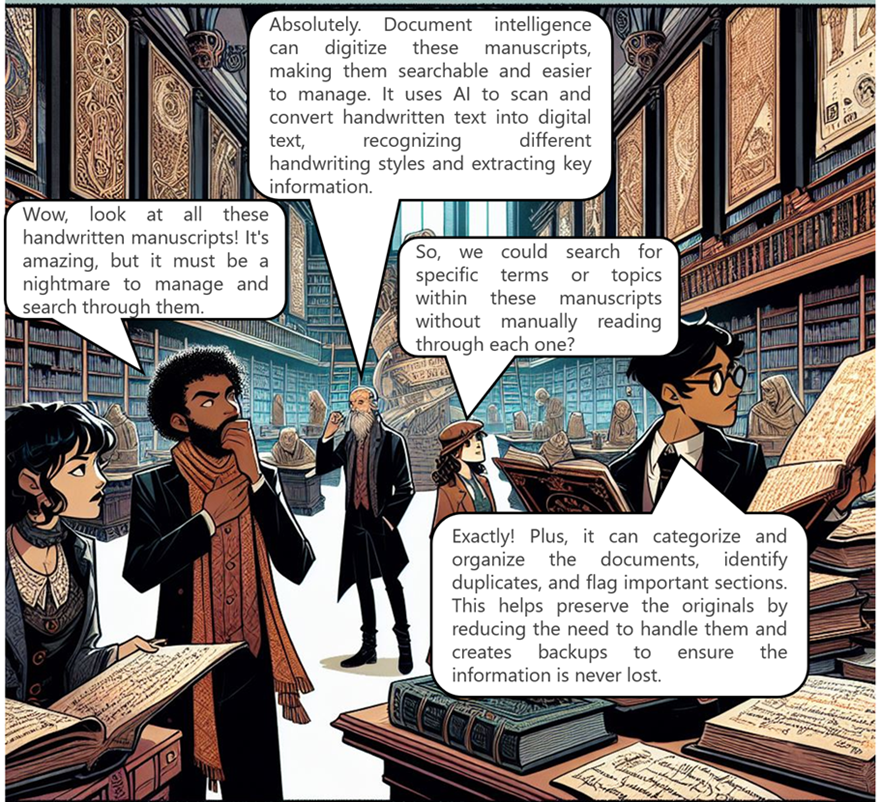
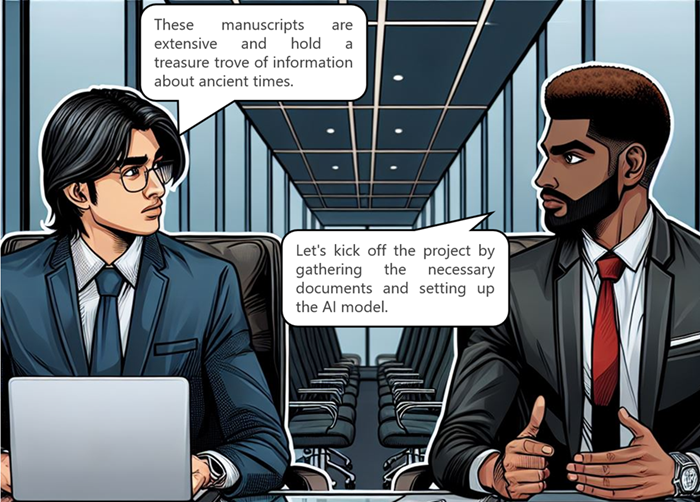

# Transforming Manuscript Management with Document Intelligence

## Introduction
In a library filled with countless handwritten manuscripts, managing and searching through these valuable documents can be a daunting task. However, document intelligence offers a revolutionary solution. This dialogue between Alice, Bob, Charlie, and David explores how AI-powered document intelligence can digitize, organize, and preserve handwritten manuscripts, making them easily searchable and accessible. The conversation highlights the potential of this technology to transform the way we handle historical documents, opening up new possibilities for research and preservation.

Alice, Bob, Charlie and David share their findings with development team. 

