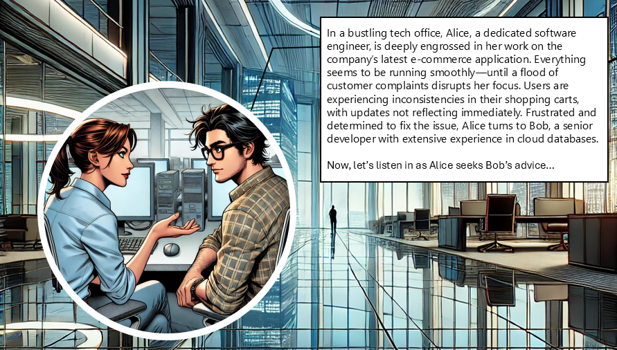

# Cosmos DB Read Consistency

## Introduction
Olivia and Ethan, two IT professionals, discuss how to choose the right consistency levels when using Cosmos DB.
 

<html lang="en">
<head>
    <meta charset="UTF-8">
    <meta name="viewport" content="width=device-width, initial-scale=1.0">
    <title>Image Carousel</title>
    
</head>
<body>
    

        <button class="carousel-button" onclick="prevImage()">Previous</button>
        
        <button class="carousel-button" onclick="nextImage()">Next</button>
    

</body>
</html>
