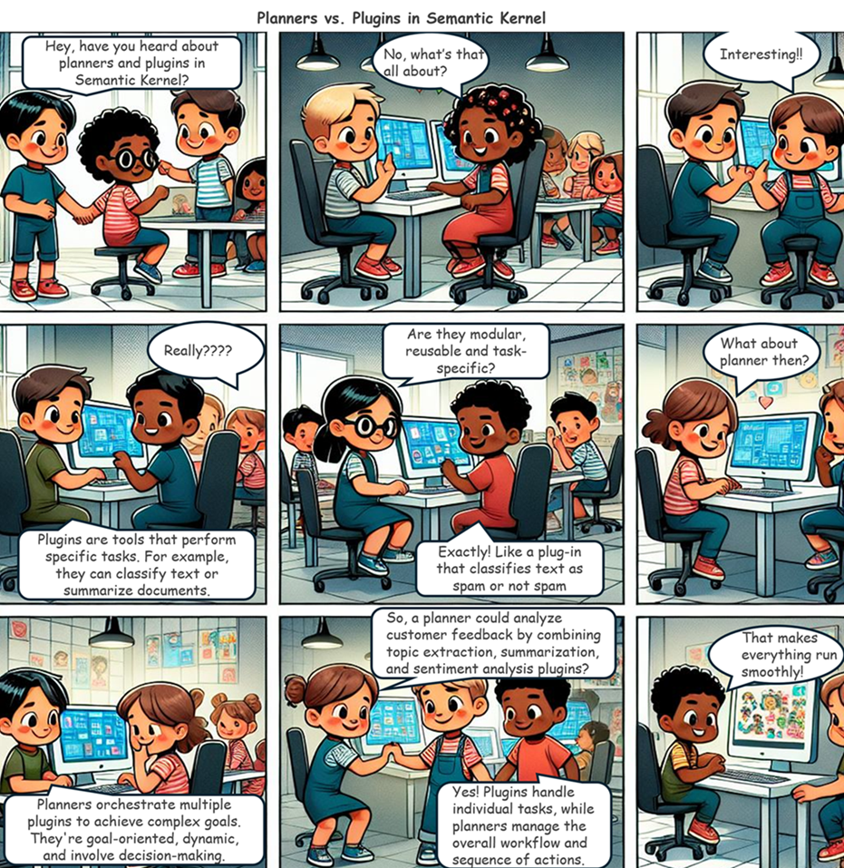

# Planners vs. Plugins in Semantic Kernel

## Introduction
Welcome to our comic strip adventure where we explore the fascinating world of Semantic Kernel! Join our characters as they dive into the concepts of planners and plugins, discovering how these powerful tools work together to make complex tasks easier and more efficient. Whether you're a tech enthusiast or just curious about how things work behind the scenes, this comic will give you a fun and engaging look at the magic of planners and plugins. Let's get started!

