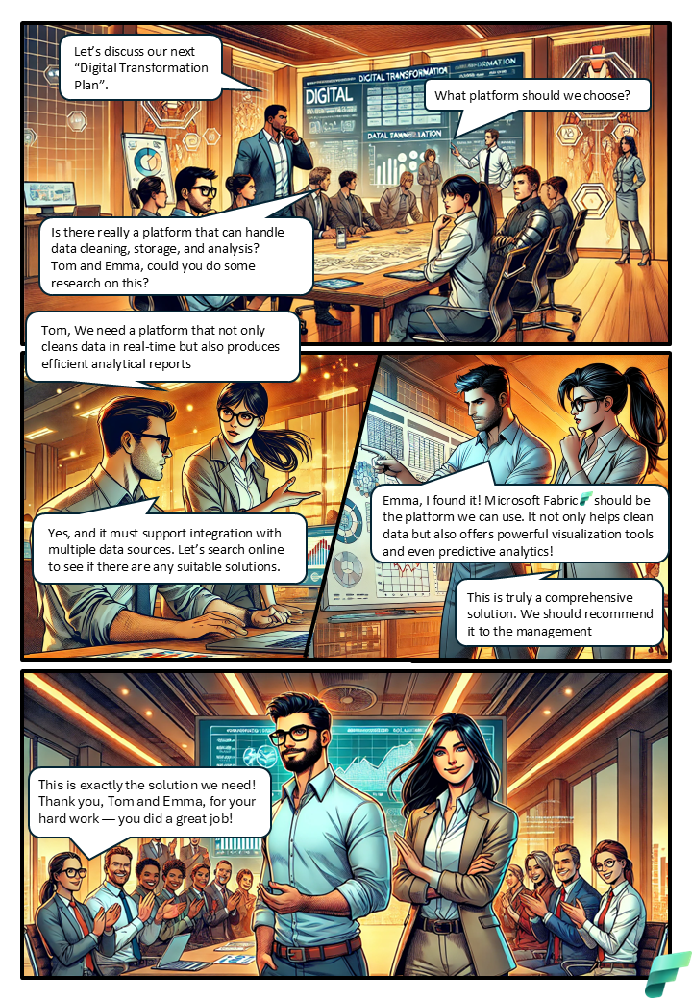

# Why Microsoft Fabric

## Introduction
This image is a comic-style illustration depicting a business meeting where team members are discussing their next "Digital Transformation Plan." The conversation revolves around selecting an appropriate platform that can handle data cleaning, storage, and analysis. The team considers various options and ultimately decides on Microsoft Fabric as the solution that meets their needs.

## Knowledge Check

What is the primary goal of the project discussed in the image?

<form id="quizForm">
  <input type="radio" id="q1" name="answer" value="q1">
  <label for="a1"> To improve data security</label> 
  <input type="radio" id="q2" name="answer" value="q2">
  <label for="a2">To create a unified data platform for analytics</label> 
  <input type="radio" id="q3" name="answer" value="q3">
  <label for="a3">To develop new wearable technology</label> 
  <input type="radio" id="q4" name="answer" value="q4">
  <label for="a4">To enhance SQL query performance</label> 
  <button type="button" onclick="checkAnswer()" class="styled-button">Submit</button>
</form>

