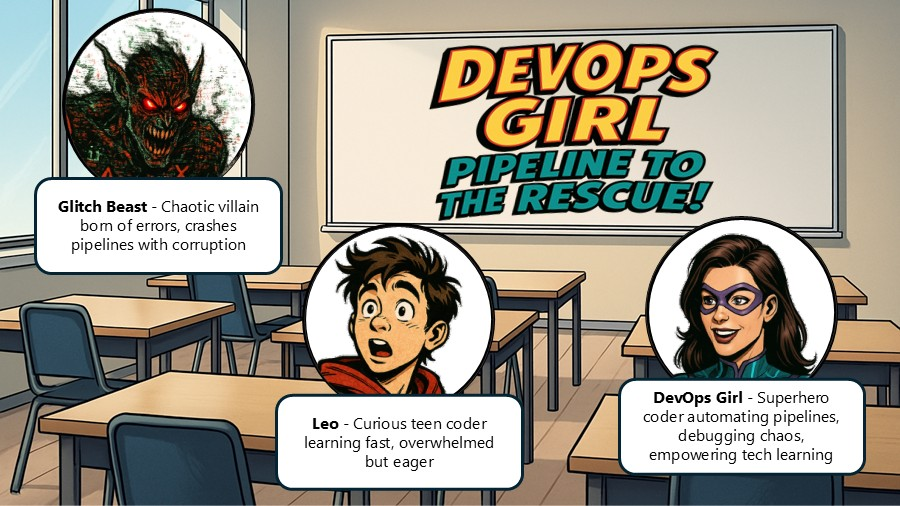

# DevOps Girl – Pipeline to the rescue!

## Introduction
In a near-futuristic world where software development powers everything from city infrastructure to education systems, stability and speed are essential—but chaos is never far behind. Deep in the digital realm, a dangerous force has awakened: the Glitch Beast. Born from corrupted code, broken builds, and unresolved errors, the Glitch Beast thrives in manual deployments, poor automation, and misconfigured pipelines. Every failed test and delayed release feeds its strength. Humanity’s ability to deploy code efficiently and securely is under siege.
But all is not lost.

From the heart of a high-tech training facility emerges a hero unlike any other: DevOps Girl. With an athletic build, a suit glowing with circuit patterns, and a utility belt stocked with debugging gadgets, she is more than just a coder—she is a symbol of clarity in the face of complexity. DevOps Girl has a gift: she can visualize and optimize CI/CD pipelines, debug code in midair, and summon test bots to battle errors at lightning speed. Her mission? To teach the world the power of Azure DevOps Pipelines and bring automation, precision, and peace to the tech world.

By her side is Leo, a bright and curious teen stepping into the world of software development. Eager to learn but easily overwhelmed, Leo represents every student starting their coding journey. With his trusty laptop plastered in stickers and his hoodie pulled tight, Leo brings a sense of humor and heart to the team. Under DevOps Girl’s guidance, he learns not just how to write code—but how to deliver it with confidence and control.
Together, they must face the Glitch Beast and all the confusion it brings. Through lessons in YAML syntax, pipeline stages, test automation, and production approvals, DevOps Girl shows Leo—and readers—how technology can be mastered, and how even the most intimidating systems can become tools of empowerment.
Welcome to DevOps Girl: Pipeline to the Rescue!
Where learning is heroic, automation is the weapon, and saving the day means shipping clean code.

<html lang="en">
<head>
    <meta charset="UTF-8">
    <meta name="viewport" content="width=device-width, initial-scale=1.0">
    <title>Image Carousel</title>
    
</head>
<body>
    

        <button class="carousel-button" onclick="prevImage()">Previous</button>
        
        <button class="carousel-button" onclick="nextImage()">Next</button>
    

  

        <h2>Knowledge Check</h2>
        <form id="knowledgeCheckForm">
            

                
Question 1: What is the main purpose of GitHub Actions?

                
                <label><input type="radio" name="question1" value="A">A) To write code automatically  </label> 
                <label><input type="radio" name="question1" value="B">B) To automate workflows such as testing, building, or deploying code</label> 
                <label><input type="radio" name="question1" value="C">C) To store files on GitHub  </label> 
                <label><input type="radio" name="question1" value="D"> D) To design user interfaces</label>
            

            

                
Question 2: Where are GitHub workflow files typically stored?

               <label><input type="radio" name="question2" value="A">A) In the root of the repository  </label> 
                <label><input type="radio" name="question2" value="B">B) In a folder named `src/workflows` </label> 
                <label><input type="radio" name="question2" value="C">C) In the `.github/workflows/` directory  </label> 
                <label><input type="radio" name="question2" value="D"> D) In a folder called `automation/`</label>
            

            

                
Question 3: What file format is used to define workflows in GitHub Actions?

               <label><input type="radio" name="question3" value="A">A) `.html`  </label> 
                <label><input type="radio" name="question3" value="B">B) `.exe`  </label> 
                <label><input type="radio" name="question3" value="C">C) `.yml` or `.yaml`  </label> 
                <label><input type="radio" name="question3" value="D"> D) `.json`</label>
            

            

                
Question 4: What are the main building blocks of a GitHub Actions workflow?  

               <label><input type="radio" name="question4" value="A">A) Pages, Repos, Commits </label> 
                <label><input type="radio" name="question4" value="B">B) Scripts, Branches, Merges  </label> 
                <label><input type="radio" name="question4" value="C">C) Workflows, Jobs, Steps, Actions  </label> 
                <label><input type="radio" name="question4" value="D"> D) Tokens, Secrets, Forks</label>
            
            
            

                
Question 5: What happens when you push new code to a GitHub repository with an active workflow?

               <label><input type="radio" name="question5" value="A">A) The repository is deleted  </label> 
                <label><input type="radio" name="question5" value="B">B) A new branch is created  </label> 
                <label><input type="radio" name="question5" value="C">C) The defined workflow is triggered automatically  </label> 
                <label><input type="radio" name="question5" value="D"> D) Nothing happens until you manually start it</label>
            
               
            <button type="button" onclick="checkAnswers()">Submit</button>
        </form>
        

    

    
  
</body>
</html>
