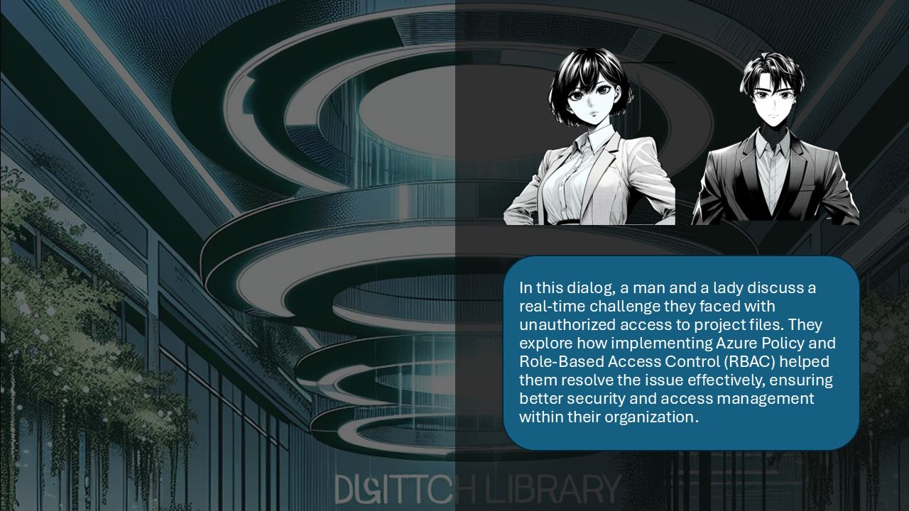

# Overcoming Access Control Challenges with Azure Policy and RBAC

## Introduction
In this dialog, a man and a lady discuss a real-time challenge they faced with unauthorized access to project files. They explore how implementing Azure Policy and Role-Based Access Control (RBAC) helped them resolve the issue effectively, ensuring better security and access management within their organization. 

<html lang="en">
<head>
    <meta charset="UTF-8">
    <meta name="viewport" content="width=device-width, initial-scale=1.0">
    <title>Image Carousel</title>
    
</head>
<body>
    

        <button class="carousel-button" onclick="prevImage()">Previous</button>
        
        <button class="carousel-button" onclick="nextImage()">Next</button>
    

 

        <h2>Knowledge Check</h2>
        <form id="knowledgeCheckForm">
            

                
Question 1: How can Azure RBAC help in managing access to sensitive project files?

                
                <label><input type="radio" name="question1" value="A">A) By allowing unrestricted access to all users</label> 
                <label><input type="radio" name="question1" value="B">B) By assigning permissions based on user roles</label> 
                <label><input type="radio" name="question1" value="C">C) By encrypting all project files</label> 
                <label><input type="radio" name="question1" value="D"> D)By deleting sensitive files after use</label>
            

            

                
Question 2: What is a key component of Azure's data protection policy that supports RBAC implementation?

               <label><input type="radio" name="question2" value="A">A) Unlimited access for all employees</label> 
                <label><input type="radio" name="question2" value="B">B) Role-based access control guidelines</label> 
                <label><input type="radio" name="question2" value="C">C) Regular deletion of old files</label> 
                <label><input type="radio" name="question2" value="D"> D) Public sharing of sensitive information</label>
            

            

                
Question 3: How can Azure Policy help enforce compliance across different Azure resources?

               <label><input type="radio" name="question3" value="A">A) By allowing unrestricted access to all resources</label> 
                <label><input type="radio" name="question3" value="B">B) By defining and enforcing rules on resource configurations</label> 
                <label><input type="radio" name="question3" value="C">C) By encrypting all data automatically</label> 
                <label><input type="radio" name="question3" value="D"> D) By deleting non-compliant resources</label>
            

            

                
Question 4: What is the role of Azure Policy in managing resource locks and preventing accidental changes?

               <label><input type="radio" name="question4" value="A">A) Azure Policy automatically deletes resources after a certain period</label> 
                <label><input type="radio" name="question4" value="B">B) Azure Policy can enforce resource locks to prevent accidental deletion or modification</label> 
                <label><input type="radio" name="question4" value="C">C) Azure Policy allows unrestricted changes to all resources</label> 
                <label><input type="radio" name="question4" value="D"> D) Azure Policy encrypts all resource data</label>
            
            
           
            <button type="button" onclick="checkAnswers()">Submit</button>
        </form>
        

    

    
  
</body>
</html>
