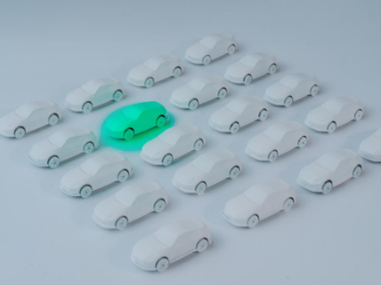
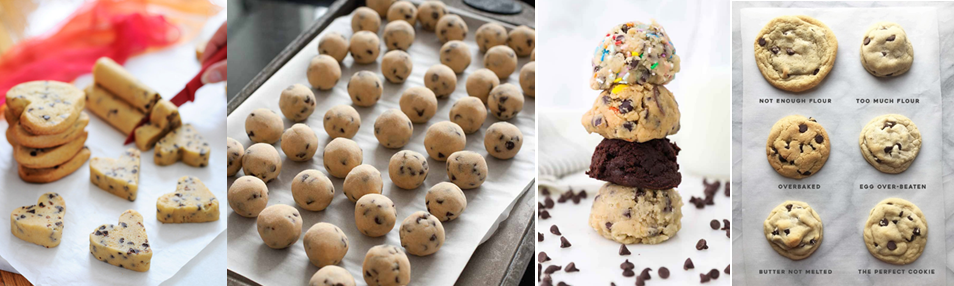

# Perform hyperparameter tuning with Azure Machine Learning

## Introduction

#### Parameter
* Parameters are values within a machine learning model that are determined from the training data. They are internal configuration variables that can be estimated from the data. 
#### Hyperparameter
* Hyperparameters are values you set to influence the training process of a machine learning model. They are not derived from the training data but are used to configure how the model is trained to improve its accuracy.

## How to play
**Section 1:**  
What is a hyperparameter vs model parameter?

Imagine your machine learning model is like a car. We can compare different parts of the car to hyperparameters and parameters in a machine learning model.

    
    

        

            

                

                    Represent the internal mechanisms of car, which are determined by the car's mechanical design. Example: engine, gears, tires
                

            

            

                
<i>Clue</i>

                
Parameter

            

        

        

            

                

                    Represent external settings, which you adjust according to a personal preference or a specific journey. Example: angle of your steering wheel, the position of your seat
                

            

            

                
<i>Clue</i>

                
Hyperparameter

            

        

    

    <h2>Configure a sampling method for hyperparameter tuning in Azure Machine Learning</h2>
    
Azure Machine Learning supports various sampling methods for hyperparameter optimization. The specific values used in hyperparameter tuning depend on the type of sampling method:

    <ul>
        <li><strong>Grid Sampling</strong> tries every possible combination of values in the search space.</li>
        <li><strong>Random Sampling</strong> randomly selects a value for hyperparameter from the search space.</li>
    </ul>

    
    

        

            

                

                  This is like checking how the car drives when you change the seat position, mirror angles, and steering wheel height in every possible way. In ML, this method tries every possible combination of hyperparameters in the search space to find what works best.
                

            

            

                
<i>Clue</i>

                
Grid Sampling 

            

        

        

            

                

                  Instead of changing everything step by step, this is like randomly tweaking things in car (e.g., adjusting the air conditioning, the radio volume, etc). It’s quicker and can sometimes give you a surprisingly good setting without having to try everything.

                

            

            

                
<i>Clue</i>

                
Random Sampling 

            

        

    

    <h2>Work with environments in Azure Machine Learning</h2>
    
In Azure Machine Learning, environments encapsulate the environment where your machine learning task happens, specifying software packages, environment variables, and settings around your training and scoring scripts. An Azure Machine Learning environment includes the dependencies (like software runtime and libraries) needed to run your training and scoring script on your compute resource.

There are two types of environments:

    <ul>
        <li><strong>Curated environment:</strong> are available to you in Azure Machine Learning by default. Curated Environment are predefined environments containing popular ML frameworks and tools.</li>
        <li><strong>Custom environment: </strong> You can create and manage your own custom environments. This allows you to define consistent, reusable runtime contexts for your experiments.</li>
    </ul>

    
    

        

            

                

           Looking to use store-bought cookie dough (Environment) & reuse the cookie dough for the cookie (Machine Learning experiment) you are making?It's provided by Azure ML and is available in your workspace.These precreated environments allow for faster deployment time. 

                

            

            

                
<i>Clue</i>

                
Curated Environment 

            

        

        

            

                

               Do you want to make new cookie dough (Environment) for each cookie (Machine Learning experiment) you are making? You're responsible for setting up your ___ and installing every package that your training script needs on the compute target. 

                

            

            

                
<i>Clue</i>

                
Custom Environment  

            

        

    

